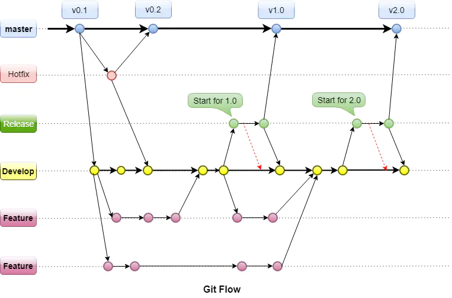
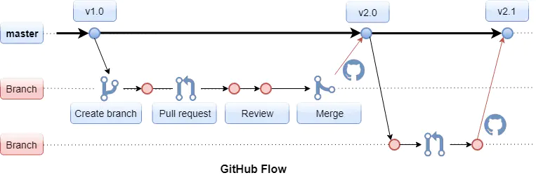
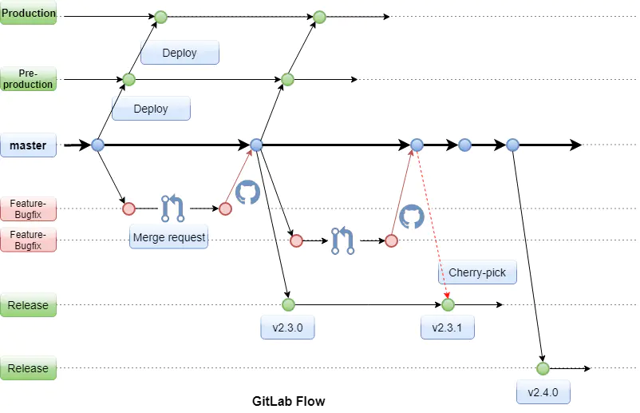
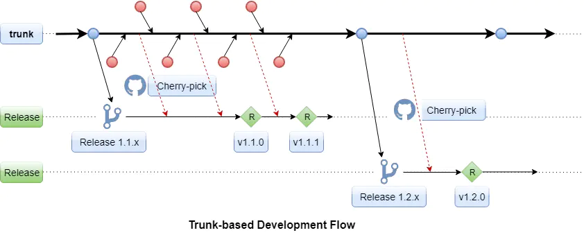
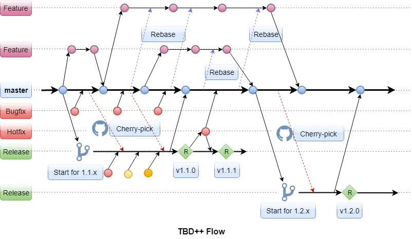

<h1 align = "center">Git分支管理</h1>

# 几大主流分支管理模型

- Git Flow

- GitHub Flow
- GitLab Flow
- TBD Flow
- TBD++ Flow

# Git Flow

Git Flow是由Vincent Driessen于2010 年提出的代码分支管理模型，git-flow并不是Git社区官方推荐的工作流。

Git Flow存在两个长期的独立分支：主分支master和开发分支develop，主分支用于版本发布，主分支的每个版本都是质量稳定和功能齐全的发布版。开发分支用于日常开发工作，存放最新的开发版代码。当开发分支的代码达到稳定状态并可以发布版本时，代码需要被合并到 master 分支，然后标记上对应的版本标签（tag）。

如果需要开发新的功能或者解决代码中的问题，则创建辅助分支来解决问题，辅助分支常用于：功能开发（Feature），版本发布（Release），问题修复（Hotfix）等，在辅助分支上的工作完成后，辅助分支将被删除。

- Feature分支的目的是开发新模块或新功能以满足客户需求，从develop分支创建，开发结束后只需要合并回develop分支，并不需要合并回master主分支。

- Release分支是用于准备发布的版本分支，从develop分支创建，创建时已经包含了发布所需要的所有功能，所以在这个分支上不再开发新功能，仅对这个预发布版本进行修复问题，创建文档及其他与发布相关的工作，一切就绪后将Release分支合并回master主分支并打上相应的版本号标签（Tag），同时也合并回develop分支。创建单独的Release分支可以避免在不同发布版本上的工作互相受影响，例如团队A准备发布版本1.0的同时，团队B正在进行版本1.1的功能开发，二者相互独立，不会互相影响。

- Hotfix分支通常用于紧急修复当前发布的版本中出现的严重问题，从发布版本的标签或master主分支创建，问题修复后合并回master主分支并打上新的版本号标签（Tag），同时也合并回develop分支或者正在进行中的Release分支。创建单独的Hotfix分支可以避免打断正在进行中的各项开发工作，客户也不需要等到下一个发布周期才能拿到修复。

  

  

  Git Flow需要同时维护两个甚至更多分支，Hotfix分支从master创建，Release和Feature分支从develop创建，工作完成后又需要将代码合并回 develop 和 master。在实际应用中，很多开发者会忘记合并回 develop 或者 master，并且各辅助分支之间互相独立，如果从master上pull代码不够及时，一方面可能造成某个分支长期使用已经过时或者错误的代码，另一方面如果与master相隔较远，合并分支时可能会有大量代码冲突，往往需要花费很多时间来消除代码冲突，并且非常容易出错，影响项目的持续集成。

  

  Git Flow的优点在于流程清晰，分支管理严格，适用于发布周期比较长的“版本发布”，发布周期可能是几周，几个月，甚至更长时间。由于保持两个长期分支同步的开销较大，所以Git flow并不适用于快速的“持续发布”，ThoughtWorks还专门将Git flow列为不被推荐的技术，建议彻底停止使用。

  # GitHub Flow

  GitHub Flow是由Scott Chacon于2011年提出的代码分支管理模型，这是GitHub官方推荐的开发流程，以快速部署为目标，目前大部分开源项目都遵循这一流程。

  Github Flow最大的特点是只有一个长期分支，即主分支master，且主分支始终保持可发布状态。从master上创建新分支进行功能开发、问题修复等，这些分支通过pull request将代码合并到master。为了保证主分支的代码质量，master的权限只开放给一部分人。Pull request是请求别人pull你的代码库（repository），也就是把开发分支的代码经过代码评审并通过测试后，让有权限的管理员合并回master。不过在实际情况中，代码评审不可能检查出提交的代码中的所有问题，所以对于每次提交的代码进行自动化测试，主分支代码的自动化部署尤其重要，自动化测试能在产品部署前及时发现一部分问题，如果产品部署之后发现严重问题，自动化部署可以在最短时间内把产品回滚到上一个版本。
  
   
  
  
  
  Github Flow的优点在于流程简单灵活，不需要考虑及管理太多的分支，适用于需要快速集成及“持续发布”的项目，这类项目可能需要每天发布一个版本，甚至一天发布多个版本。但是对于应用场景比较复杂的情况，例如：多个环境下的产品部署，多个版本的发布或问题修复，只有一个master便会显得力不从心。
  
  # GitLab flow
  
  GitLab Flow是由GitLab 的 CEO Sytse Sijbrandij 于 2014 年正式发布的代码分支管理模型，属于GitHub Flow的演进版本，与GitHub相同之处是也存在一个长期主分支mater，从master上创建新分支进行功能开发、问题修复等，结束后合并回master。与GitHub不同之处是GitLab flow又考虑多环境部署等现实因素，增加production产品分支用于在不同的环境下部署产品，或者从master的稳定版本创建release发布分支用于发布软件。
  
  如果在产品分支或者发布分支发现问题，就从对应版本分支创建修复分支，修复完成之后，GitLab Flow遵循 “上游优先” 的合并策略，也就是将代码先合并到 master，再合并到下游的production或release分支。
  
  和Github Flow类似，master的修改权限只开放给部分人，开发分支的工作完成后，代码通过merge request（类似于GitHub Flow中的pull request）请求有权限的管理员把代码合并（merge）回主分支。
  
  
  
  # TBD Flow
  
  TBD (Trunk-based Development) Flow是由Paul Hammant于2013年提出的模型, TBD Flow最大的特点是所有开发都基于主干trunk，不再有长期的开发分支，要求所有的提交尽快回到主干，这样可以共享最新的代码，并且能尽可能地减少合并冲突。如果需要发布版本，可以基于trunk直接生成新的分支用于发布。
  
  TBD Flow没有pull或者push request，要求开发人员尽快把代码提交到主干分支，但是TBD Flow缺乏严格的流程来保证每一份提交代码的质量，如果一些项目开发人员众多且水平不一，同时工作在主分支上可能会在产品发布时才发现不可预知的问题，所以TBD Flow更适用于需要快速迭代的产品，如果在主干分支上发现问题，可以快速进行修复再合并回主干分支。
  
  
  
  # TBD++ Flow
  
  TBD++ Flow是Arrus公司软件研发部门从2015年开始一直沿用的Git分支管理模型，产品项目的客户主要是电信级服务运营商，每个国家或地区的需求在主要功能上一致，但在客户定制化方面又存在不少差异，同时项目开发周期较长，整个周期一般在3个月到2年之间，软件产品在项目前期需要有快速的迭代，在项目后期需要有稳定的发布版本。TBD++ Flow以敏捷开发为核心，同时吸收了以上几个主流模型的优点，主要特点如下：
  
  #### 1. 基于功能的主分支
  
  只存在一个长期的独立分支，即主分支master，主分支上功能齐全，通过自动测试保证基本功能运行正常，因为自动测试覆盖不全面或者手动测试不及时，所以无法保证主分支的每个版本都是质量稳定的发布版，但是可以根据功能的完成程度直接从主分支上创建迭代版本用于针对不同客户或者不同时期的功能演示。基于master开发功能或者修复问题需要用到以下两个辅助分支：
  
  - Feature分支：为了开发新模块或新功能以满足客户需求，从主分支上创建Feature分支，但是并不要求Feature分支上所有的提交尽快回到主分支，开发完成并且通过代码评审及功能测试后才能合并回master主分支。为了共用主分支上的最新代码以及避免合并代码时解决代码冲突引起的额外开销，在功能开发过程中Feature分支需要始终与master保持同步。
  - Bugfix分支：基于主分支创建Bugfix分支修复主分支上发现的问题，修复完成并且通过代码评审后代码合并回master主分支。

  基于主分支的Feature分支和Bugfix分支完成后，开发者直接将代码合并回主分支master，不需要像GitLab或GitHub那样依赖于少数几个有权限的管理员，这是因为如果一个项目中开发人员比较多的话，管理员没办法做到对每部分代码都熟悉或掌握，所以代码质量交由代码评审和功能测试来掌控，合并代码回主分支的操作由开发者自己完成。

  主分支上的新代码有时候可能因为评审或测试不全面而带来新问题，例如破坏其他功能模块，甚至影响整体功能。为了能尽早发现问题，主分支上的每次提交都会触发系统级自动化测试，并且周期性地对主分支进行人工测试。一旦发现问题，主分支的专职配置管理员（Software Configuration Manager，SCM）将根据问题的严重性和紧迫性决定是否需要直接回退引起问题的提交，或者基于master创建bugfix分支进行问题修复。

  #### 2. 基于发布的Release分支
  
  Release分支负责对外发布软件产品，每个Release分支也会配备专职版本配置管理员SCM，SCM具有对Release分支的最高管理权限。当master上已经包含了某个发布所需要的所有功能，并且没有已知的严重问题，此时由SCM从主分支上创建Release分支准备系统集成测试，和Git Flow相同，在此分支上不再进行新功能的开发，仅在这个分支上进行修复问题，创建文档，客户参数配置及其他与发布相关的工作，这些代码同时也需要合并回master以确保主分支功能的完整性。
  
  在每个Release分支正式发布前可能还需要将主分支上的一部分关键问题的修复选择性地同步（Cherry-pick）到Release分支，这个操作也是由SCM完成。
  
  Release分支上的工作一切就绪并通过系统集成测试后，SCM在Release分支上打上相应的版本号标签（Tag）进行发布，这点和Git Flow在主分支上进行发布不同。
  
  软件产品发布之后，如果发现紧急或者严重的问题，此时需要基于版本发布时的Release分支标签创建Hotfix分支来修复此类问题，问题修复后合并回该Release分支以及其他同样需要此修复的Release分支，并打上新的版本号标签（Tag）用于发布，同时代码也需要合并回master以确保主分支的健壮性。
  
  
  
  # 小结
  
  以上几个主流的git代码分支管理模型各具特点，流程只是一个辅助工具，没有最好，只有最合适，例如，如果开发团队规模较小又比较分散，产品发布周期较短，可以选择GitHub flow或者GitLab flow；如果开发团队规模较大，产品发布周期较长可以选择Git flow，发布周期较短可以选择TBD flow；如果开发团队规模大，产品发布周期长，同时对敏捷的要求比较高，可以考虑TBD++ flow。每个组织根据产品、项目、人员的特点找到最合适的模型才是我们共同的目标。
  
  
  
  # 当前痛点
  
  无调试环境（用于前后端联调），只有一个开发环境（开发稳定环境），当多个功能需求并行开发时，部署无多套调试环境
  
  # 解决方案
  
  - 这个问题加钱就可以解决，增加服务器，部署多套调试环境
  
  - 根据目前团队状况，可以考虑增加feature分支，废弃个人工作分支dev-xxx，每次一个新需求从master拉取新建一个feature分支，命名方式：feature+需求+上线日期，例如（feature-optuav-20220408），服务器部署多套系统用于调试（比如区分端口），jekins增加手动选择feature分支进行部署，发布时注意看页面是否部署成功（手动选择一遍，也可改善大家不习惯看钉钉消息是否部署成功），调试完毕后合并到dev-release分支，原先pre-release分支拉取dev-release流程不变
  
    若不考虑用feature分支，也可直接用个人工作分支发布到调试环境